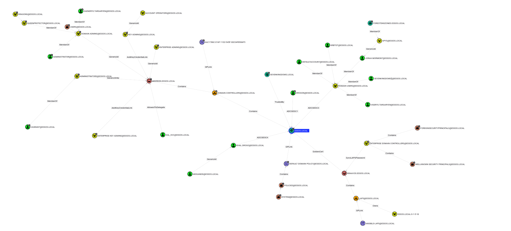

# Changelog

## v2.3.0

### Date
`2024/12/28`

### Summary

The latest update introduces enhanced functionality and optimizations for handling Active Directory objects. It includes support for `IssuancePolicies`. Fixing unconstrained delegation issues where FQDNs were replaced with SIDs to ensure compatibility with BloodHound CE. GUIDs are now properly parsed in the Windows Active Directory format, adhering to the little-endian structure, this allow to fixe all issues related to ACEs permissions. Password policy attributes from Active Directory are retrieved and associated with the domain object in domain.json. Additionally, Kerberos service ticket encryption algorithms are now extracted via the `msDS-SupportedEncryptionTypes` attribute. Finally, the code has been optimized to improve object type verification and streamline offline value replacements in `src/json/checker/common.rs`, enhancing performance and maintainability.

### Examples

*The tests were conducted on Mayfly's GOAD lab environment.*

> Shortest paths to systems trusted for unconstrained delegation

```cypher
MATCH p=shortestPath((n)-[:Owns|GenericAll|GenericWrite|WriteOwner|WriteDacl|MemberOf|ForceChangePassword|AllExtendedRights|AddMember|HasSession|Contains|GPLink|AllowedToDelegate|TrustedBy|AllowedToAct|AdminTo|CanPSRemote|CanRDP|ExecuteDCOM|HasSIDHistory|AddSelf|DCSync|ReadLAPSPassword|ReadGMSAPassword|DumpSMSAPassword|SQLAdmin|AddAllowedToAct|WriteSPN|AddKeyCredentialLink|SyncLAPSPassword|WriteAccountRestrictions|WriteGPLink|GoldenCert|ADCSESC1|ADCSESC3|ADCSESC4|ADCSESC5|ADCSESC6a|ADCSESC6b|ADCSESC7|ADCSESC9a|ADCSESC9b|ADCSESC10a|ADCSESC10b|ADCSESC13|DCFor|SyncedToEntraUser*1..]->(m:Computer))
WHERE m.unconstraineddelegation = true AND n<>m
RETURN p
LIMIT 1000
```

#### RustHound-CE - v2.3.0

```bash
rusthound-ce.exe -c All -d ESSOS.local -u vagrant -p vagrant -z
```



#### SharpHound - v2.5.9.0

```bash
SharpHound.exe -c All -d ESSOS.local --ldapusername vagrant --ldappassword vagrant
```


